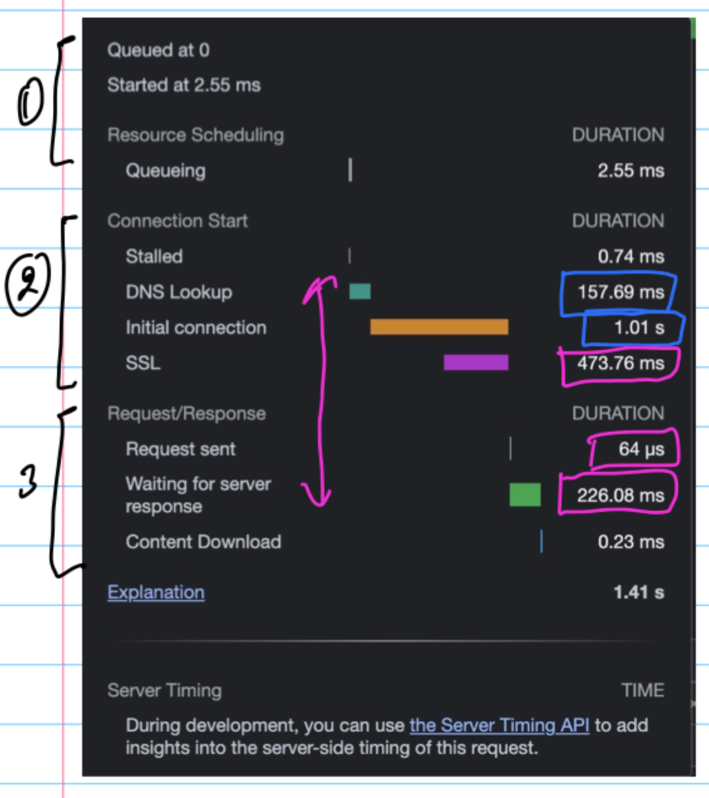

### DOM

Document Object Modle

1. Perfomance
2. Accessibility
3. Best practices
4. SEO

https://example.com/
http://127.0.0.1:5500/test.html

Protocols

1. Communication - http, tcp
2. Management - FTP (File Transfer Protocol), SNMP()
3. Security - https, SSL(Secure Socket Layer)



Domain Name
OS
Router
ISP
DNS(Domain Name Server/System)

https://www.w3schools.com/jsref/met_document_getelementsbyclassname.asp
